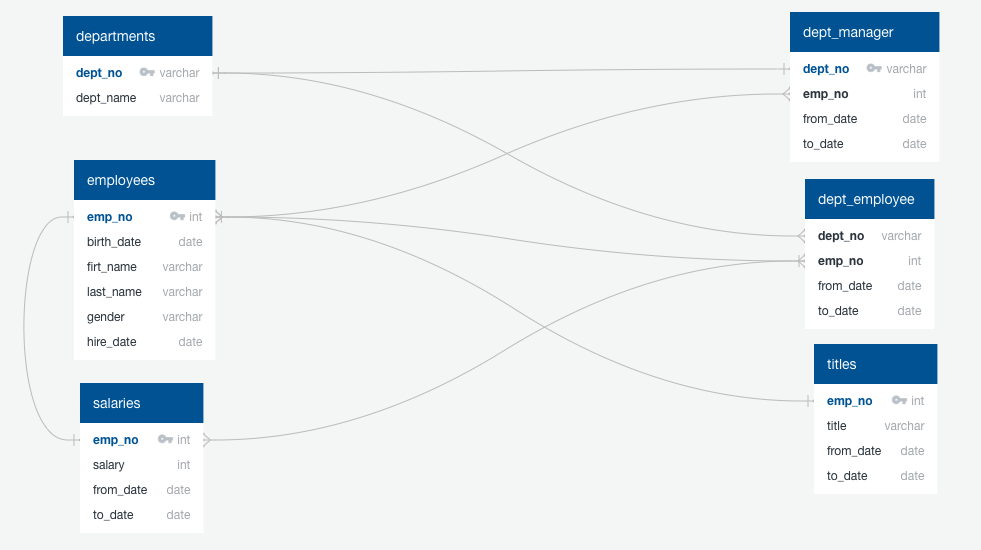
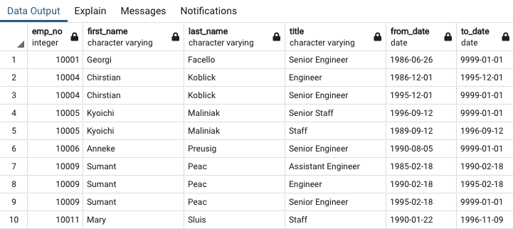
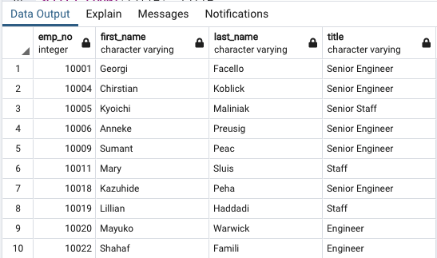
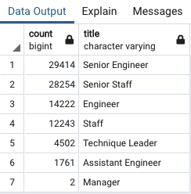
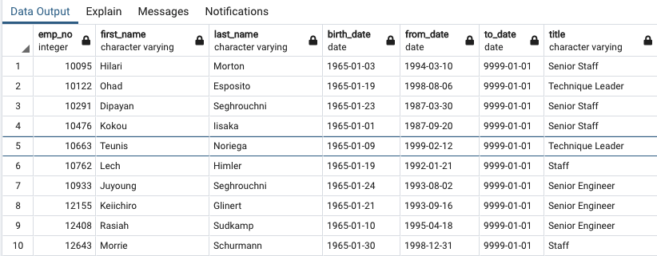

# Pewlett-Hackard-Analysis
 Created Entity Relationship Diagrams (ERD), to perform data modeling and complete analysis on an employee database using SQL and PostgreSQL techniques.
- ### Entity Relationship Diagram (ERD) using Quick Database Diagrams (QuickDBD)
    
# Overview of the Analysis
 The purpose of this analysis is to address the retiring workforce at Pewlett Hackard. In order to account for this, I have been tasked with identifying employees who are most likely to retire soon by their title and employees who could transition to a mentorship program compared to just retiring.

# Results: 

- ## Retirement Titles
    

- ## Unique Titles
    
- ## Retiring Titles
    
- ## Mentorship Eligibility
    

# Summary: 

-  Based on the criteria given for this analysis employees born between 1952 and 1955 there are 90,396 employees who are likely to retire soon.
-  Based on the criteria given for employees born in 1965 and have current roles with no termination dates there are 1,550 employees eligible for the mentorship program.
- Based on th criteria given we can find retirement count by department and also count of eligible mentorship available. So, more Senior and experienced employees should be given mentorship. So, junior employees can be trained efficiently for seniority roles.

 